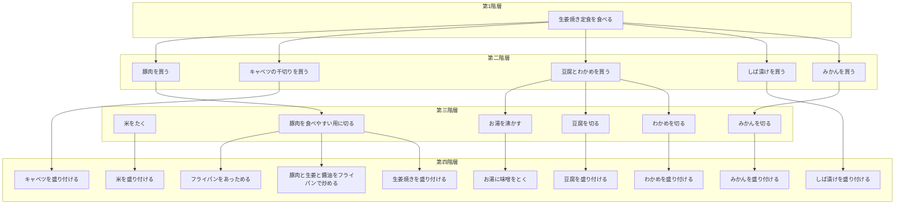

```mermaid
flowchart TD
    subgraph "第1階層"
    id1["生姜焼き定食を食べる"]
    end
    subgraph "第二階層"
    id2["豚肉を買う"]
    id3["キャベツの千切りを買う"]
    id4["豆腐とわかめを買う"]
    id5["しば漬けを買う"]
    id6["みかんを買う"]
    end
    subgraph "第三階層"
    id7["米をたく"]
    id8["豚肉を食べやすい用に切る"]
    id9["お湯を沸かす"]
    id10["豆腐を切る"]
    id11["わかめを切る"]
    id12["みかんを切る"]
    end
    subgraph "第四階層"
    id13["フライパンをあっためる"]
    m0["米を盛り付ける"]
    id14["豚肉と生姜と醬油をフライパンで炒める"]
    i15["生姜焼きを盛り付ける"]
    m1["キャベツを盛り付ける"]
    id15["お湯に味噌をとく"]
    id16["豆腐を盛り付ける"]
    id17["わかめを盛り付ける"]
    m2["しば漬けを盛り付ける"]
    m3["みかんを盛り付ける"]
    end
    id1 --> id2
    id1 --> id3
    id1 --> id4
    id1 --> id5
    id1 --> id6
    id2 --> id8
    id4 --> id9
    id4 --> id10
    id4 --> id11
    id6 --> id12
    id9 --> id15
    id10 --> id16
    id11 --> id17
    id3 --> m1
    id5 --> m2
    id12 --> m3
    id7 --> m0
    id8-->id13
    id8 --> id14
    id8-->i15
```
