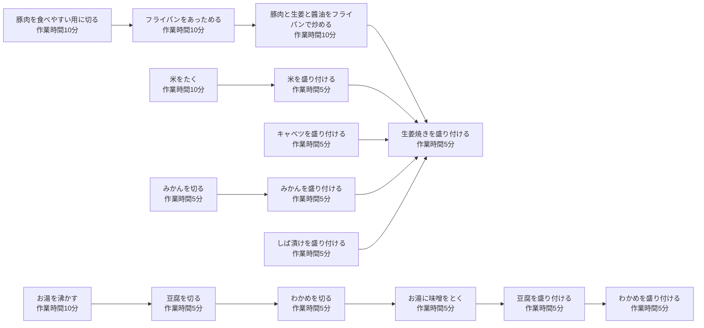

```mermaid
flowchart LR
    id7["米をたく
    作業時間10分"]
    id8["豚肉を食べやすい用に切る
    作業時間10分"]
    id9["お湯を沸かす
    作業時間10分"]
    id10["豆腐を切る
    作業時間5分"]
    id11["わかめを切る
    作業時間5分"]
    id12["みかんを切る
    作業時間5分"]
    id13["フライパンをあっためる
    作業時間10分"]
    m0["米を盛り付ける
    作業時間5分"]
    id14["豚肉と生姜と醬油をフライパンで炒める
    作業時間10分"]
    m4["生姜焼きを盛り付ける
    作業時間5分"]
    m1["キャベツを盛り付ける
    作業時間5分"]
    id15["お湯に味噌をとく
    作業時間5分"]
    id16["豆腐を盛り付ける
    作業時間5分"]
    id17["わかめを盛り付ける
    作業時間5分"]
    m2["しば漬けを盛り付ける
    作業時間5分"]
    m3["みかんを盛り付ける
    作業時間5分"]
    id7-->m0
    id8-->id13-->id14
    id9-->id10-->id11-->id15-->id16-->id17
    id12-->m3
    id14-->m4
    m0-->m4
    m1-->m4
    m3-->m4
    m2-->m4
```
